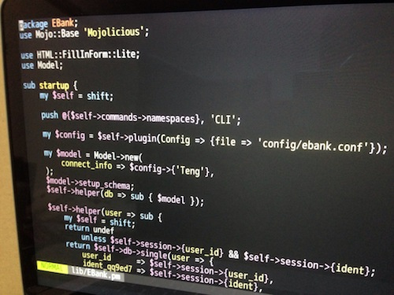
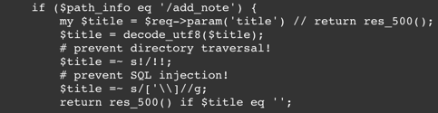

# Problem

## Table of Content

- [1. Capture the flag!](#1-capture-the-flag)
- [2. cheap cipher](#2-cheap-cipher)
- [3. cheap cipher (revenge)](#3-cheap-cipher-revenge)
- [4. directories](#4-directories)
- [5. The flag is a lie.](#5-the-flag-is-a-lie)
- [6. Game #1](#6-game-1)
- [7. alphabet?](#7-alphabet)
- [8. Horizontal line](#8-horizontal-line)
- [9. encode-encode](#9-encode-encode)
- [10. easy crackme](#10-easy-crackme)
- [11. hiragana](#11-hiragana)
- [12. ASCII Art](#12-ascii-art)
- [13. Yet Another G00913](#13-yet-another-g00913)
- [14. from login form](#14-from-login-form)
- [15. ZIP is zip](#15-zip-is-zip)
- [16. medium crackme](#16-medium-crackme)
- [17. Fragments of gzip](#17-fragments-of-gzip)
- [18. Which is the flag?](#18-which-is-the-flag)
- [19. stairs](#19-stairs)
- [20. searcher](#20-searcher)
- [21. loop](#21-loop)
- [22. hidden 1](#22-hidden-1)
- [23. Picross](#23-picross)
- [24. Gyazo](#24-gyazo)
- [25. HEYYEYAAEYAAAEYAEYAA](#25-heyyeyaaeyaaaeyaeyaa)
- [26. retro crackme](#26-retro-crackme)
- [27. Online banking](#27-online-banking)
- [28. feel the rhythm](#28-feel-the-rhythm)
- [29. jpeglitch](#29-jpeglitch)
- [30. tell me a message](#30-tell-me-a-message)
- [31. hidden 2](#31-hidden-2)
- [32. simple sqli](#32-simple-sqli)
- [33. from secure login form](#33-from-secure-login-form)
- [34. CAPTCHA the Flag](#34-captcha-the-flag)
- [35. console](#35-console)
- [36. iRC](#36-irc)
- [37. steg noobs](#37-steg-noobs)
- [38. super secret notes](#38-super-secret-notes)
- [39. giveme_shellcode](#39-giveme_shellcode)
- [40. sudden_death](#40-sudden_death)
- [41. Pokemon battle](#41-pokemon-battle)
- [42. unreadable message](#42-unreadable-message)

## 1. Capture the flag!

Category: **misc**  
Point: **10**  
Solved: **1682 / 2216**  
[Writeup](writeup/01.md)

### Description

<pre>Q1RGCg==</pre>

### Flag

```
CTF
```

## 2. cheap cipher

Category: **crypto**  
Point: **50**  
Solved: **1357 / 2216**  
[Writeup](writeup/02.md)  
[Source code](source/02)

### Description

<pre>==AVoVGImxWYnBSazByUzMkUzQ1XLNTW</pre>

### Flag

```
S3CR3T_K3Y
```

## 3. cheap cipher (revenge)

Category: **crypto**  
Point: **80**  
Solved: **294 / 2216**  
[Writeup](writeup/03.md)  
[Source code](source/03)

### Description

<pre>rKrUl+/clKHb4u/sm6sgnaPfnO/XkO=ewqPU45bRjp4gwa7NntoM467Onu/enqPRlakgj6Egjp0e1gAA</pre>

### Flag

```
All your Base64 are belong to us
```

## 4. directories

Category: **for**  
Point: **60**  
Solved: **671 / 2216**  
[Writeup](writeup/04.md)

### Description

<a href="dat/directories.zip-22a823d589b0c0b6560cfbae6f6f89c1">directories.zip-22a823d589b0c0b6560cfbae6f6f89c1</a>

### Flag

```
snakebites
```

## 5. The flag is a lie.

Category: **misc+guessing**  
Point: **200**  
Solved: **18 / 2216**  
[Writeup](writeup/05.md)

### Description

<a href="dat/TheFlagIsALie-8f3cce5cc4d27fcd822437c53f7c8e6b">TheFlagIsALie-8f3cce5cc4d27fcd822437c53f7c8e6b</a>

### Hint

Someone broke the beginning of the file.

### Flag

```
HELLO 6502
```

## 6. Game #1

Category: **web**  
Point: **70**  
Solved: **463 / 2216**  
[Writeup](writeup/06.md)  
[Source code](source/06)

### Description

<a href="http://q6.ctf.katsudon.org">q6.ctf.katsudon.org</a>

### Flag

```
YIPPEE
```

## 7. alphabet?

Category: **crypto**  
Point: **80**  
Solved: **123 / 2216**  
[Writeup](writeup/07.md)  
[Source code](source/07)

### Description

<p>This message is a certain game's monologue. The flag is name of the game in capital letters.</p>
<pre>ΥΔΗΖΙΝΔJΙ-ΧJΙΟΜJGGΔΙΒ ΑJΜΟ "ΥJΓ" ΓΥΝ ΙJΡ WΖΖΙ ΥΖΗJGΔΝΓΖΥ, ΥΙΥ ΟΔΗΖ ΝΟΥΜΟΖΥ ΑGJΡΔΙΒ ΜΖQΖΜΝΖGΤ. "QΥΠΝ" ΗΥΙΥΒΖΥ ΟJ ΖΝΧΥΚΖ ΑΜJΗ ΟΓΖ ΥΔΝΟJΜΟΖΥ ΝΚΥΧΖ. WΠΟ ΟΓΖ ΜΖΥG QJΤΥΒΖ JΑ "ΥΜFΥΙJΔΥ" ΔΙ ΟΓΖ ΒΥGΥΣΤ ΓΥΝ JΙGΤ ΝΟΥΜΟΖΥ......</pre>

### Flag

```
ARKANOID
```

## 8. Horizontal line

Category: **misc**  
Point: **70**  
Solved: **313 / 2216**  
[Writeup](writeup/08.md)  
[Source code](source/08)

### Description

<a href="dat/hline.gif-74d643f5f6a94f4efba37b2d12c6af30">hline.gif-74d643f5f6a94f4efba37b2d12c6af30</a>

### Flag

```
PIXEL
```

## 9. encode-encode

Category: **misc**  
Point: **90**  
Solved: **193 / 2216**  
[Writeup](writeup/09.md)

### Description

<p>Do not encode byte strings twice, you know. In UTF-8, double encoded bytes (bytes encoded twice) makes me sick. </p><pre>
# regular UTF-8 encode
漢 -> \346\274\242
# encode twice in UTF-8
漢 -> \303\246\302\274\302\242</pre><p>What is this?</p><pre>c3:a3:c2:81:c2:8d:c3:a3:c2:82:c2:83:c3:a3:c2:81:c2:b7:c3:a3:c2:81:c2:a1:c3:a3:c2:82:c2:83:c3:a3:c2:83:c2:bc:c3:83:c2:a3:c3:82:c2:83:c3:82:c2:bb:c3:83:c2:a3:c3:82:c2:82:c3:82:c2:b6:c3:83:c2:a3:c3:82:c2:83:c3:82:c2:bb:e3:81:b5:e3:82:89:e3:81:a3:e3:81:90</pre>

### Flag

```
きゃぷちゃー・ザ・ふらっぐ
```

## 10. easy crackme

Category: **bin**  
Point: **70**  
Solved: **311 / 2216**  
[Writeup](writeup/10.md)  
[Source code](source/10)

### Description

<a href="dat/easy_crackme-47c32e7cc8eae23d1d8ef5948b3dce4a">easy_crackme-47c32e7cc8eae23d1d8ef5948b3dce4a</a>

### Flag

```
旗RM7RF4o2
```

## 11. hiragana

Category: **trivia**  
Point: **90**  
Solved: **99 / 2216**  
[Writeup](writeup/11.md)

### Description

<pre>あいうえおかきくけこさしすせそたちつてとなにぬねのはひふへほまみむめもらりるれろがぎぐげござじずぜぞばびぶべぼぱぴぷぺぽやゆよわん</pre>
<pre>りろみるむのしきむなきしぴぎいきむごばうばけしみむぐぼうざがしきむげじうぺがさぎむじまさぷぴしぜりたてうぜのさゆむげきうぞがしすむごもうがぎこしむごひうびのしほむずきうばこまろるきもうばこかこらじもうぞのさべむげぼいちがさずむじぐうぞぴしむもそぐつびけれゆむごばつてのぽがむげぺうぜのさゆむごばうぐのぺおむごぼうぷがさざりれぼうぺけしへむげれうやのかうらるさなとけしもむざばうばぴさぞむぐぐちねけさべむざばうざのさゆむぐぐそとぷいごむごぼうじぴしぐむごぼうじぴしぐむごぼそぜけしこるろじしちぴしすもぺそつもけしぜむげぬうぞけさもむげぼうびけさよむげじうぎけしかむげまいちがらぐりへばこずのしすもぺそつもけしぜむげぬうぞけさもむげぼうびけさぎむなきそめけしせらりよちふけさぐむごもうぷぴしぞむごぬうぐのさずむじれたもがしむらされうぱけさぷむずきうざのぎぱらにぐうびけぺそらしきうぞのらぐるせてとやはとならりよなべけしきむぐじうぱぴしろむじぐうずのさぞむごひうぴこぬぱむぐじうぱけさぷむずきいちがらぐりへばこずのしすもぺそつもけしぜむげぬうぞけさもむげぼうびけしかむげぬうぷのさりむなきてほよぬいむごぼそぺけしむりひじうぴこえなむぐぼうぞこさぱむぐぼいちのじぷむごれうびのかべむぼれえりぴせぷむねひうぞがよつむぐさうずはこぱぷのきにざがぺひむごばえみのかふむぶぺうやけしうむぐようぞけさもむざばうざのさゆむげぬうばけしみむぐぼうざがしせむぐさうぜがしむもよさうががしげむごばえなぴそあむごばすちぴさざむごさうやけしせむぐさうぞけさもむざばうざのさゆむなさぬるけしへむげぼててぴしせらぺぼうざのさぞむじぼうぺがしおむごぼうががしへむげぬうずのさぐもにぺとげがせぬむぴそえのがせやむずううぐのしなむごきうぞけさもむざばうざのさゆむなさうげぴしぐむごまうぴけしきむごれうぐのさざらりよちふけしきむじうそむけしこむざばうざのさゆむなさてほよぬいむごぼてほよぬいるよようげのしむむじぐうぐぴぷたりそまなぐぎにとるおぺうびけびへらけぺうばははぼむごもうげのしけむじもしぴぎいきむごばうばけしみむぐぼうざがさぐむげじうびけぺみむごばなとがかいりりじうぐぎひなむげじうびけぺみむごばなとがぺあむごれうぱけさべむげぼいちがぷたりきばうびこせむもぶばうやけさぱむげきうざのしれむぐぼてごがしねむごてすぐのしへむげぬうぷのさりむなけん</pre>

### Flag

```
蜘蛛となめくじと狸
```

## 12. ASCII Art

Category: **trivia**  
Point: **60**  
Solved: **258 / 2216**  
[Writeup](writeup/12.md)  
[Source code](source/12)

### Description

<p>Who is this?</p><pre>                  ''=~('('.('?').
                '{'.('['^'+').("\["^
              ')').('`'|')').('`'|'.').
            ('['                     ^'/'
          ).((                         '"')
        ).+(                             '`'^
       '$')                                 .''.
      ('`'                                   |'!'
     ).+(                                     '`'|
    '-')                                       .''.
   ('`'                                         |((
   ')')                                         )).(
  '`'|                                    '!').( '`'|
  '.')                                .''.     (  '{'
  ^((    '['                  ))).('`'          ^  '#'
 ).(     (  '`')           |((                  (  '/'
)))      )      .('`'|'.').                     (  '['
^((      (                                      (  ','
)))      )                                      )  .+(
'`'      |                                       ( '!'
)).     (                                        ( '['
 )^+    (                                        ( '"'
 ))     )                                        . '"'
. ((    (                                        ( ((
(  ((  (                                         ( ((
(   '}')       )))))))))              )))).+     ')'
)    ;$:    =((         '.'        ))^      '~'  ;$~
= ((  ((        '@'))))|             '(';$^=      ((
( (   ((      ((  ')')  ))    )    )) ))^+  ((    (
( (  '['       )))));($/)     =    '`'|'.';$,=    (
(  (  ((                      (                  (
 (    ((                      (                 ((
 (    '('                     )                 ))
  )   )))                     )                )))
   )))^'}'                    ;                $\=
     "\`"|              (     (    (          '!'
     )));(              (     (    (          $:)
     )))=((             ')'))^'}';$~         ='*'
     |"\`";                                  ($^)
     =('+')^         '_';$/='&'|"\@";$,=    '['&
      "\~";$\=    ','^'|';$:='.'^('~');$~= '@'|
       "\(";$^=  ((                     "\)"))^
       '[';$/="\`"|  '.';$,='('^'}';$\=  ('`')|
        '!';$:=')'      ^'}';$~="\*"|    "\`";
         $^='+'^'_'                    ;($/)=
          '&'|('@');$,=            '['&"\~";
           $\=','^'|';$:='.'^'~';$~='@'|'('
           ;$^=')'^'[';$/='`'|'.';$,=('(')^
            '}';$\='`'|'!';$:=')'^('}');$~=
             '*'|'`';$^='+'^'_';$/='&'|'@';
              $,='['&'~';$\=','^'|';$:='.'
                ^'~';$~='@'|'(';$^=(')')^
                 '[';$/='`'|'.';$,="\("^
                   '}';$\='`'|('!');$:=
                     ')'^'}';$~=('*')|
                        '`';$^='+';</pre>

### Flag

```
Damian Conway
```

## 13. Yet Another G00913

Category: **PPC**  
Point: **100**  
Solved: **119 / 2216**  
[Writeup](writeup/13.md)

### Description

<code>FLAG_Q13_{first 200-digit prime found in consecutive digits of π}</code>

### Flag

```
FLAG_Q13_54882046652138414695194151160943305727036575959195309218611738193261179310511854807446237996274956735188575272489122793818301194912983367336244065664308602139494639522473719070217986094370277053921717
```

## 14. from login form

Category: **web**  
Point: **120**  
Solved: **114 / 2216**  
[Writeup](writeup/14.md)  
[Source code](source/14)

### Description

<p><a href="http://q14.ctf.katsudon.org">q14.ctf.katsudon.org</a></p>

<p>Update: I fixed q14, and it was broken since Apr 26. Sorry ;(</p>

### Flag

```
FLAG_hogee_fuga_piyopiyopiyo
```

## 15. ZIP is zip

Category: **misc**  
Point: **110**  
Solved: **44 / 2216**  
[Writeup](writeup/15.md)  
[Source code](source/15)

### Description

<p>You can capture the flag by sorting.</p>
<a href="dat/zip.zip-ded3b0a45d60b9d834025daab478e1a1">zip.zip-ded3b0a45d60b9d834025daab478e1a1</a>

### Flag

```
BDVNCpguUQSjsZJ
```

## 16. medium crackme

Category: **bin**  
Point: **130**  
Solved: **70 / 2216**  
[Writeup](writeup/16.md)  
[Source code](source/16)

### Description

<p>The flag is <code>**********</code>.</p>
<a href="dat/medium_crackme-2dbaa2302bae56de6252defa96da2270">medium_crackme-2dbaa2302bae56de6252defa96da2270</a>

### Flag

```
gD0Fbs3642
```

## 17. Fragments of gzip

Category: **misc**  
Point: **80**  
Solved: **133 / 2216**  
[Writeup](writeup/17.md)

### Description

<p>I'm missing gzip header. But there is only compressed data:</p>
<pre>d3:2d:03:03:85:dc:fc:7c:2e:00:22:4a:78:e2:0c:00:00:00:0a</pre>

### Flag

```
-vvvvvv moo
```

## 18. Which is the flag?

Category: **web**  
Point: **90**  
Solved: **130 / 2216**  
[Writeup](writeup/18.md)  
[Source code](source/18)

### Description

<a href="http://q18.ctf.katsudon.org">q18.ctf.katsudon.org</a>

### Flag

```
RegularExpression
```

## 19. stairs

Category: **crypto**  
Point: **80**  
Solved: **69 / 2216**  
[Writeup](writeup/19.md)  
[Source code](source/19)

### Description

<pre>G
NrD
NdeyM
muNaHnh
ZDpJtRSLp
vypFhPXzxLB
wVBISmyIhtMTQ
XeLOfAFrVjAESSf
lIzxxAnyangFlzLAQ
VESahvDXtmnKNBRpIkf
pSMRLNFnHViPJhqvuhrrp
fymLjhBJlZFdNlYswhNlImR
lKzWwzjlpigqOHVSnNxxgpScc
wyoHPACOBPTGZfmXDBAHdWDHrcV
pXIZwFMTQuWdSgGHgtUtiBXcGEDGh
gMaGyanBffyKcGFiQjRnqSrvOrlJYFb
vHCWLsqPRiUcCwMuzioVrOmEjQwffudND
wnkDeijzqzRHzNVwZaWsZvMrhlsLjRGUFbe</pre>

### Flag

```
GreatPyramidOfGiza
```

## 20. searcher

Category: **web**  
Point: **180**  
Solved: **36 / 2216**  
[Writeup](writeup/20.md)  
[Source code](source/20)

### Description

<p><a href="http://q20.ctf.katsudon.org">q20.ctf.katsudon.org</a></p>
<p><a href="dat/searcher.pl-dabe04e9b2c8f7818f4e11a6dc1d79a6">source</a></p>


### Hint

<pre>CREATE TABLE IF NOT EXISTS user (
    user_id    INTEGER NOT NULL PRIMARY KEY,
    name       VARCHAR(255) NOT NULL,
    password   VARCHAR(255) NOT NULL,
    UNIQUE (name)
);</pre>

### Flag

```
ADMINIMDA
```

## 21. loop

Category: **web**  
Point: **70**  
Solved: **182 / 2216**  
[Writeup](writeup/21.md)  
[Source code](source/21)

### Description

<p><a href="http://q21.ctf.katsudon.org">q21.ctf.katsudon.org</a></p>
<p>Do not attack :)</p>

### Flag

```
6890c6f34d3c3ad95cfa13ab321943d7
```

## 22. hidden 1

Category: **web**  
Point: **100**  
Solved: **63 / 2216**  
[Writeup](writeup/22.md)

### Description

:)

### Flag

```
xcomglobal
```

## 23. Picross

Category: **PPC**  
Point: **250**  
Solved: **11 / 2216**  
[Writeup](writeup/23.md)  
[Source code](source/23)

### Description

<code>nc ctf.katsudon.org 17023</code>

### Flag

```
280fa17f505ccf7ee308cb5d021c5565
```

## 24. Gyazo

Category: **web+guessing**  
Point: **210**  
Solved: **20 / 2216**  
[Writeup](writeup/24.md)  
[Source code](source/24)

### Description

<a href="http://q24.ctf.katsudon.org">q24.ctf.katsudon.org</a>

### Hint

1) flag.png<br />
2) accesscode = md5(salted_filename)

### Flag

```
Ninjas can't catch you if you're on fire.
```

## 25. HEYYEYAAEYAAAEYAEYAA

Category: **steg**  
Point: **80**  
Solved: **87 / 2216**  
[Writeup](writeup/25.md)

### Description

<p>The sound can not be heard.</p>
<a href="dat/HEYYEYAAEYAAAEYAEYAA.wav-a7cb9e1dc56ef5597a9535ae353dcb13">HEYYEYAAEYAAAEYAEYAA.wav-a7cb9e1dc56ef5597a9535ae353dcb13</a>

### Flag

```
HEYSPECTROGRAM
```

## 26. retro crackme

Category: **bin**  
Point: **150**  
Solved: **13 / 2216**  
[Writeup](writeup/26.md)  
[Source code](source/26)

### Description

<a href="dat/retro_crackme-96b844b59fbd6270ef03b510a3f21e3b">retro_crackme-96b844b59fbd6270ef03b510a3f21e3b</a>

### Flag

```
looking for l0ve s0ng
```

## 27. Online banking

Category: **web**  
Point: **270**  
Solved: **18 / 2216**  
[Writeup](writeup/27.md)  
[Source code](source/27)

### Description

<p>What is the initial amount of <code>john</code>?</p>
<p><a href="http://q27.ctf.katsudon.org">q27.ctf.katsudon.org</a></p>
<p></p>

### Hint

1) did you try to login as john?<br />
2) http://q27.ctf.katsudon.org/404

### Flag

```
294307500
```

## 28. feel the rhythm

Category: **misc**  
Point: **90**  
Solved: **46 / 2216**  
[Writeup](writeup/28.md)  
[Source code](source/28)

### Description

<a href="dat/rhythm.wav-d08530ac6de2a8601cef1a7b2a0dc6fa">rhythm.wav-d08530ac6de2a8601cef1a7b2a0dc6fa</a>

### Flag

```
CAMEL2
```

## 29. jpeglitch

Category: **misc**  
Point: **120**  
Solved: **71 / 2216**  
[Writeup](writeup/29.md)  
[Source code](source/29)

### Description

<p>The glitch algorithm is simple, like this:</p>
<pre>perl -i -pe's/a/b/g' flag.jpg</pre>
<a href="dat/glitch.zip-06718696c3e01de29d4d8f577004f537">glitch.zip-06718696c3e01de29d4d8f577004f537</a>

### Flag

```
glitch_5157cc4572
```

## 30. tell me a message

Category: **bin+guessing**  
Point: **230**  
Solved: **4 / 2216**  
[Writeup](writeup/30.md)

### Description

<p>This program cannot print a character well... but it's simple :)</p>
<p><a href="dat/tellme-39079dcc9a39dfb72bc6f40842bdeac8">tellme-39079dcc9a39dfb72bc6f40842bdeac8</a></p>
<p>Update: This problem has a bug. You can solve it, but maybe unreasonable... I'm going to provide new binary, just a moment :)</p>

### Hint

you can get a message by brute-force attack. have you tried the input of all possible?

### Flag

```
ﾐﾝﾅﾆﾊﾅｲｼｮﾀﾞﾖ
```

## 31. hidden 2

Category: **guessing**  
Point: **120**  
Solved: **13 / 2216**  
[Writeup](writeup/31.md)

### Description

find the "flag" :)

### Hint

not A

### Flag

```
dead::beef
```

## 32. simple sqli

Category: **web**  
Point: **160**  
Solved: **19 / 2216**  
[Writeup](writeup/32.md)  
[Source code](source/32)

### Description

<a href="http://q32.ctf.katsudon.org/">http://q32.ctf.katsudon.org/</a>

### Hint

1) I thought this validates 'id' as a number...<br />
2) and I'm using regexp.

### Flag

```
700_51mpl3_27307d6c315d96bb5ea96b5830ca1e6a
```

## 33. from secure login form

Category: **web**  
Point: **180**  
Solved: **17 / 2216**  
[Writeup](writeup/33.md)  
[Source code](source/33)

### Description

<a href="http://q33.ctf.katsudon.org/">http://q33.ctf.katsudon.org/</a>

### Flag

```
r1v357
```

## 34. CAPTCHA the Flag

Category: **PPC**  
Point: **150**  
Solved: **31 / 2216**  
[Writeup](writeup/34.md)  
[Source code](source/34)

### Description

<a href="http://q34.ctf.katsudon.org/">http://q34.ctf.katsudon.org/</a>

### Flag

```
CcaaAPpTTTCccHhA
```

## 35. console

Category: **web**  
Point: **240**  
Solved: **29 / 2216**  
[Writeup](writeup/35.md)  
[Source code](source/35)

### Description

<p>available commands: <code>login, register, ...</code></p>
<a href="http://q35.ctf.katsudon.org/">http://q35.ctf.katsudon.org/</a>

### Flag

```
p4zzw0rd_m0n573r_willin9ly_347z_saltimbocca
```

## 36. iRC

Category: **web**  
Point: **150**  
Solved: **6 / 2216**  
[Writeup](writeup/36.md)  
[Source code](source/36)

### Description

<pre>&lt;akiym&gt; I'm thinking about Q36...
&lt;evilhacker&gt; how about irc bot?
&lt;akiym&gt; evilhacker: good idea. why don't you make a irc bot with me?
&lt;evilhacker&gt; sounds good
&lt;akiym&gt; :)
&lt;akiym&gt; have you ever made a irc bot?
&lt;evilhacker&gt; no
&lt;akiym&gt; okay. I'll give you source code
&lt;akiym&gt; but you don't discover the flag, right?
&lt;evilhacker&gt; of course ;)
&lt;akiym&gt; I sent
&lt;evilhacker&gt; akiym++
akiym has left #akictf-meeting
&lt;evilhacker&gt; his source code is perfect
&lt;evilhacker&gt; so I made a vulnerability, hahaha</pre>
<p><code>akictf-q36</code> is in <code>irc.freenode.net</code>.</p>
<p>Note: <strong>You DO NOT access/attack <code>ctf.katsudon.org:6669</code>.</strong> This is unrelated. (my personal IRC bouncer :-)</p>
<p>Update: akictf-q36 is unstable. It replies to such message: <code>akiym++</code> If it doesn't reply, please send an email or just a moment.</p>

### Flag

```
I <3 SQLite!
```

## 37. steg noobs

Category: **steg**  
Point: **180**  
Solved: **18 / 2216**  
[Writeup](writeup/37.md)

### Description

<a href="dat/steg_noobs.zip-5d05a159662f59e65b1f9c3113832f7c">steg_noobs.zip-5d05a159662f59e65b1f9c3113832f7c</a>

### Flag

```
d0_y0u_like_stegan0__i_hate~~
```

## 38. super secret notes

Category: **web**  
Point: **300**  
Solved: **6 / 2216**  
[Writeup](writeup/38.md)  
[Source code](source/38)

### Description

<p>find the flag.</p>
<p><a href="http://q38.ctf.katsudon.org/">http://q38.ctf.katsudon.org/</a></p>

### Hint

<p>1) 1st flag in source</p>
<p>2) </p>

### Flag

```
7rAv3r5AL_w17H_8yPA55_f0R_1nJ3c710n
```

## 39. giveme_shellcode

Category: **pwn**  
Point: **200**  
Solved: **35 / 2216**  
[Writeup](writeup/39.md)  
[Source code](source/39)

### Description

<pre><code>nc pwnable.katsudon.org 17039</code></pre>
<p><a href="dat/giveme_shellcode-eebca4141478c0dc649459a2d897bc2a">giveme_shellcode-eebca4141478c0dc649459a2d897bc2a</a></p>

### Flag

```
5H3LLC0D3_G0Lf_15_345Y
```

## 40. sudden_death

Category: **web+pwn**  
Point: **320**  
Solved: **13 / 2216**  
[Writeup](writeup/40.md)  
[Source code](source/40)

### Description

<p><a href="http://pwnable.katsudon.org:17040/">http://pwnable.katsudon.org:17040/</a></p>

### Flag

```
5UDD3n_539M3N74710N_f4ul7~
```

## 41. Pokemon battle

Category: **web**  
Point: **250**  
Solved: **12 / 2216**  
[Writeup](writeup/41.md)  
[Source code](source/41)

### Description

<p>pokemon!<br /><a href="http://q41.ctf.katsudon.org/">http://q41.ctf.katsudon.org/</a></p>
<p>DO NOT BRUTE FORCE!</p>
<p>Update: Sorry, I fixed a mistake. see source again :P<br />
Update: So sorry, Marumain and Mewtwo was too weak. see source again again ;(</p>

### Flag

```
w4NN483_p0k3MON_M4573R
```

## 42. unreadable message

Category: **misc**  
Point: **180**  
Solved: **9 / 2216**  
[Writeup](writeup/42.md)

### Description

<p>Here is unreadable message. Could you try to restore my message?</p>

<p>download <a href="dat/unreadable_message.zip-a2bed73cbd988469a22cde41320bbcf4">unreadable_message.zip-a2bed73cbd988469a22cde41320bbcf4</a></p>

### Flag

```
brute_it_if_you_could_not_read
```
